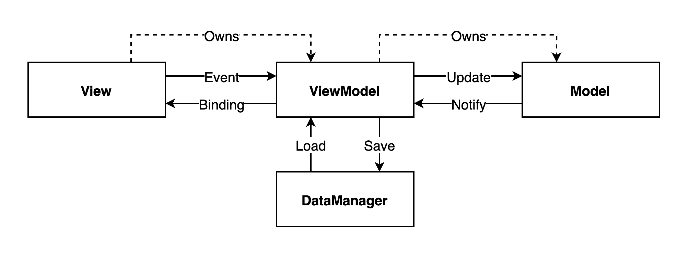
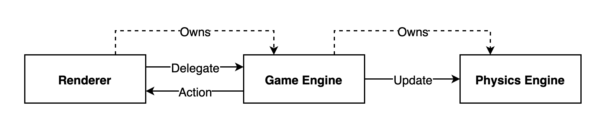
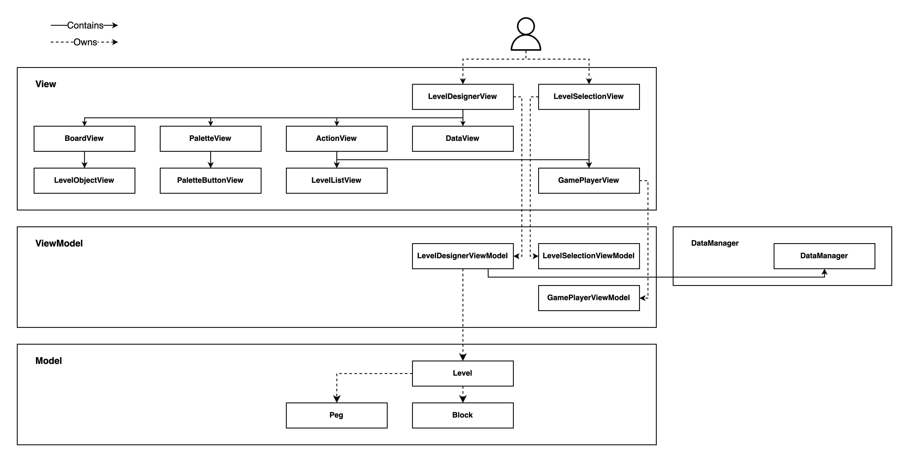
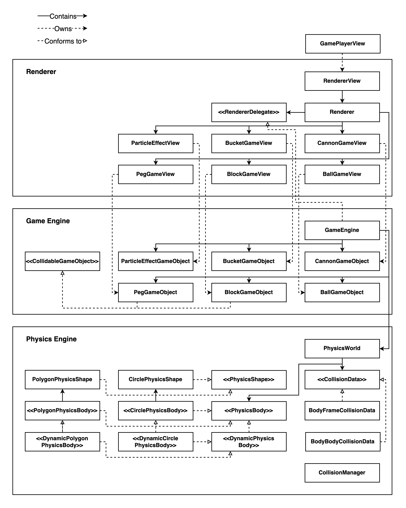
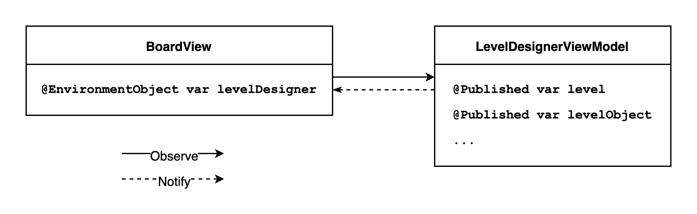
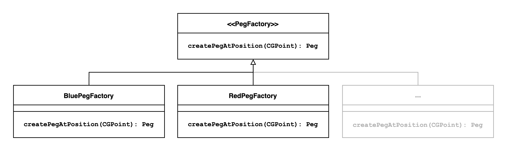
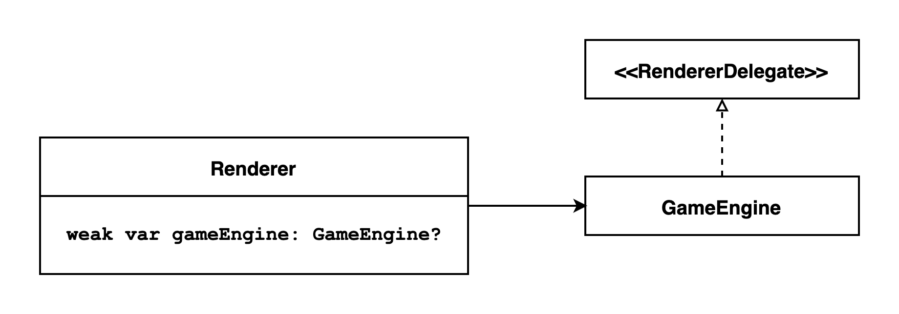

# Peggle Developer Guide

## Introduction

### [Purpose of the Developer Guide](#purpose-of-the-developer-guide)

The purpose of this developer guide is to provide a comprehensive understanding of the architecture, design patterns, and implementation details of Peggle – henceforth, application. It is intended for developers who are:
- familiar with Swift and SwiftUI,
- interested in understanding the inner workings of the application, 
- intending to making further contributions to the application.

The guide is organised into several sections, starting with an overview of the application's architecture and the relationships between its components. The application follows the **Model-View-VidewModel (MVVM)** architectural pattern to separate its domain logic and presentation logic; the guide therefore delves into the details of each component, including the model, view, and view model layers. To demonstrate the extensibility and maintainability of the application, the guide also covers the design patterns and paradigms used throughout development. In order to aid with understanding the relationships between the different components of the application – namely, the flow of data and control between them – the guide also includes diagrams to visually represent inter-component interactions.

### [Application Overview](#application-overview)

The application is intended to function as a clone of the popular video game series [Peggle](https://en.wikipedia.org/wiki/Peggle_(series)).

The level designer is used to create and edit Peggle levels. The user is able to select between different types of pegs, place pegs on a board, move them around, and delete them. Created levels can be saved for persistence between sessions, from which they may be retrieved at a later point in time for editing. The game player is used to play created Peggle levels. The user is able to control a cannon on the top of the game view to fire a ball, which will bounce between pegs as per Peggle rules. The user is unable to control the cannon when the game is in its active state.

The level designer is composed of several distinct components: the **board**, the **palette**, the **action**, and the **level list**. The board is responsible for hosting pegs and effectively acts as a canvas on which pegs can be placed, moved, or removed. The palette provides a number of buttons that can be selected to alter the type of action performed upon tapping the board. The action allows the user to perform meta-operations on the levels which they design, such as loading an existing level, saving a new level, and renaming the current level. The level list displays all created levels in chronological order with respect to the date at which they were updated, allowing the user to load and delete past levels.

The game player is composed of three separate components: the **physics engine**, the **game engine**, and the **renderer**. The physics engine is responsible for handling all physics related operations in-game, such as object movement as well as collision detection and resolution. The game engine is responsible for attributing *meaning* to the physics objects and providing an API that is used by the rendere for game logic related operations. The renderer sits on top of the game engine, displaying changes to the user by delegating game logic related operations to the game engine on every display refresh.

## Architecture

### [High-level Design](#high-level-design)

#### Level designer

The level designer adopts an **opinionated version of MVVM**, in which the view interacts with the view model to update the model, with the data manager sitting at the view model layer. The model then notifies the view model of its changes, from which the data binding between the view and the view model allows the view to observe the changes to update itself accordingly. The data manager provides an application programming interface (API) to be used by the view model to load and save data to a **JSON encoded file** for persistence. Though conventionally data management is handled by the model for MVVM, our implementation allows the view model to perform data loading and saving as to focus any domain logic concerns to the view model layer. Below is a brief overview of the roles of each component.

- **View**
    - displays data as bound with the view model
    - handles any presentation logic pertaining to rendering visual components
- **View model**
    - exposes data as bound with the view
    - performs operations as requested by the view
    - handles any domain logic pertaining to user request handling
- **Model**
    - represents and holds data related to the application
    - contains and exposes model-specific operations to be used by the view model
- **Data manager**
    - manages persistence by exposing methods for saving and loading data in device's document directory

#### Game player

The game player loosesly follows a similar approach to the MV* architecture, where by the renderer manages view related operations and the game engine and physics engine manage model related operations. The renderer delegates game logic related operations to the game engine to refresh the game state by uding `CADisplayLink`. The game engine keeps a reference to the physics engine and updates the state of the physics world with the time interval between each refresh. Below is a brief overview of the roles of each component.

- **Renderer**
    - delegates game logic update operations to the game engine
    - handles any presentation logic pertaining to rendering visual components
- **Game engine**
    - provides updated game state to the renderer for subsequent rendering
    - interacts with physics engine with time interval to update state of physics world
- **Physics engine**
    - contains physics objects and manages their physics related states
    - handles physics object manipulations based on physics data and rules

### [Low-level Design](#low-level-design)

#### Level designer

As described above in the [application overview](#application-overview), the level designer consists of four main components: board, palette, action, and data. Note how the board and palette consist further components that are the peg and palette buttons. All sub-views of the level designer view access the level designer view model via the [`@EnvironmentObject`](https://developer.apple.com/documentation/swiftui/environmentobject)  property wrapper.

#### Game player

As described above in the [application overview](#application-overview), the game player consists of three main components: renderer, game engine, and physics engine. Similiar to the level designer, the renderer contains views that own its own logical unit (game object).

The game engine contains the actual game objects that provide the view components with an interface to perform game related operations. A noteworthy implementation is how the game engine conforms to the renderer delegate protocol; the renderer contains a reference to the delegate – in this context, the game engine – and for every display refresh the renderer makes, delegates changes to be logically updated by the game engine.

The physics engine consists of a physics world that manages all interactions between physics bodies. The physics world also contains an array of collision data that contains metadata about body-to-body and body-to-frame collisions that occur for every update. Note that there exists a standalone collision manager that handles body-to-body and body-to-frame collisions.

## Design Patterns and Paradigms

This section details the design patterns and paradigms adopted during development to make the implementation more maintainable and extensible.

### [Observer Pattern](#observer-pattern)

One primary pattern that is adopted throughout the appliation is the Observer Pattern. By establishing state bindings between views and view models by (1) publishing observable state in view models via the [`@Published`](https://developer.apple.com/documentation/combine/published) property wrapper, and (2) observing view model state changes from views via the `@EnvironmentObject` property wrapper. This pattern is not explicitly implemented in the application however, as the property wrappers provided by the SwiftUI API abstract away the actual implementation.

### [Factory Method Pattern](#factory-method-pattern)

The creation of pegs is handled by a peg factory utility protocol that delegates the instantiation of a peg to concrete sub-class factories. This implementation makes it fairly easy to extend the palette with new types of pegs, as one simply needs to implement concrete factories that generate the new pegs. In the current implementation, the palette view model holds the peg factory that is accessed by the board view to create a new peg, but this implementation may change to elevate the peg factory to the level designer view model instead to make the factory easier and cleaner to access.

### [Dependency Injection Pattern](#dependency-injection-pattern)

In order to reduce coupling between view models, the view models instantiated using dependency injection. For example, the level designer view model does not inherently hold a reference to an instane of the palette, board, action, and level list view models, but receives them as parameters during initialisation. This implementation separates the concerns of constructing objects, making it easier to test the components in isolation as well, as test-specific dependencies may be injected in place of the actual dependencies.

### [Delegation Pattern](#delegation-pattern)

The delegation pattern is in place to handle interaction between the game engine and the renderer, specifically the action of refreshing the display. This pattern is implemented as (1) the renderer needs a way to fire events to the game engine for game related logic handling and (2) the game engine has to be able to notify the renderer somehow that the game state has been updated and the display needs refreshing. By using a `weak var`, both entities maintain a reference to each other to facilitate the previously mentioned interaction, whilst avoiding a strong circular reference between the two to allow proper object de-instantiation to take place.

## Testing

### [Unit Testing](#unit-testing)

The XCode project includes unit tests for the models of the application. Refer to the project for more information.

### Integration Testing

Below is an exposition on how integration tests will be performed on the application.

#### Level designer

- Test palette view
    - Should display a horizontal array of buttons, with peg palette buttons grouped together on the left, and the delete peg palette button located on the right.
- Test palette button view
    - Blue peg button
        - Should be selected by default upon start up.
        - When tapped, a semi-transparent white overlay should appear over the button.
    - Red peg button
        - When tapped, a semi-transparent white overlay should appear over the button.
    - Delete peg button
        - When tapped, a semi-transparent white overlay should appear over the button.
- Test board view
    - If a peg palette button is selected
        - When tapped, if the tap position does not overlap with another peg and does not overflow the board, a peg of the selected type should be created at the tap position.
        - When tapped, if the tap position does not overlap with another peg and does overflow the board, a peg of the selected type should not be created at the tap position.
        - When tapped, if the tap position does overlap with another peg and does not overflow the board, a peg of the selected type should not be created at the tap position.
        - When tapped, if the tap position does overlap with another peg and does overflow the board, a peg of the selected type should not be created at the tap position.
- Test peg view
    - Tap gesture
        - If the delete peg palette button is selected, the tapped peg should be deleted.
        - If the delete peg palette button is not selected, nothing should happen.
    - Drag gesture
        - If the drag release position does not overlap with another peg and does not overflow the board, the peg should be translated to the release position.
        - If the drag release position does not overlap with another peg and does overflow the board, the peg should not be translated to the release position.
        - If the drag release position does overlap with another peg and does not overflow the board, the peg should not be translated to the release position.
        - If the drag release position does overlap with another peg and does overflow the board, the peg should not be translated to the release position.
    - Long press gesture
        - The peg should be deleted from the board.
- Action view
    - SAVE button
        - When tapped, the current level opened by the level designer should be saved into persistent storage. The saved level should be visible in the level list view.
    - LOAD button
        - When tapped, the level list view should slide in from the right.
        - When tapped, it should dismiss the keyboard if it is open.
    - RESET button
        - When tapped, every peg on the board should be removed.
    - Title text field
        - When tapped, the keyboard should open.
        - When typing in the keyboard, the title of the level should be visibly updated. The title should not be saved into persistent storage unless the SAVE button is tapped afterwards.
    - START button
        - When tapped, nothing should happen.
- Level list view
    - Should display a list of previously created levels.
    - Create new level button
        - When tapped, it should clear the loaded level from the level designer–remove all pegs from the board and clear the title in the action–and redirect the user back to the level designer.
    - Existing level button
        - If one of the previously created levels is open in the level designer, the opened level should be greyed out from the list with the text "Currently open" displayed on the right-side of the item.
        - When tapped, if the tapped level is currently open, nothing should happen.
        - When tapped, it the tapped level is not currently open, it should load the pegs and title of the board into the board and action, respectively, and the user should be redirected back to the level designer.

#### Game player

- Test start up
    - Should correctly load a level by displaying pegs (1) at the correct position and (2) with the correct type.
    - Cannon should be pointing downwards.
- Test cannon
    - Should follow the position the user is holding down at.
    - Should not point upwards; i.e. the angle of the head of the cannon should not deviate more than ±90 degrees from the original angle.
    - Should turn grey once the ball is fired and the game is in its active state.
    - Should not change angle when the game is in its active state.
    - Should not fire ball when the game is in its active state.
    - SHould turn back to its original colour once the game exits its active state to the idle state.
- Test ball
    - Should be affected by gravity.
    - Should display proper collision with pegs and bounce off in a reasonable manner (parabolic trajectory).
    - Should bounce off the top and the sides of the physics world.
    - Should disappear once it collides with the bottom of the physics world (game over).
- Test peg
    - Should not be affected by gravity.
    - Should not move during collision with the ball.
    - Should glow up once collided with the ball.
    - Should disappear if in constant collision for too long with the ball.
    - Should disappear if the ball exits the physics world (game over) and if the peg is lit.
    - Should fade away and scale larger upon disappear.
